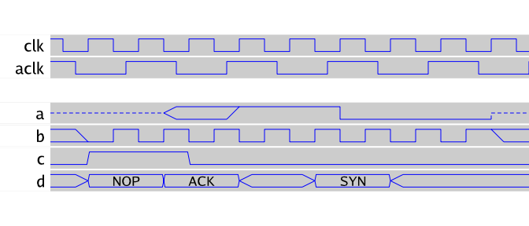

# wavy - a tool to convert ASCII art into logic trace images

## Overview

The `wavy` tool is a lightweight program to convert simple ASCII art
logic trace representations into a `PNG`. It was written because it
has very light dependencies and can be used on any platform Go
supports.

## Getting started

Build from source:
```
$ go build wavy.go
```

The `wavy` program transforms `.wvy` files into `.PNG` images. For
example, in the source repository, `examples/hello.wvy` looks like
this:
```
+0 clk
+1,.25 aclk

zzzzzxxx^^^^______zz a
xx_^_^_^_^_^_^_^_^xx b
__/^^^\_____________ c
xx<-><->xxx<->xxxxxx d NOP,ACK,SYN

```

You can invoke `./wavy` against it as follows:
```
$ ./wavy --input=examples/hello.wvy --output=hello.png
```

The generated `hello.png` looks like this:



## Syntax

Summary of the syntax:

- blank lines are rendered as half-line empty spaces
- lines that start with "`+`" are interpreted as clocks and end with the clk symbol name
  - `+0` is interpreted as the fastest clock in the trace
  - `+1` is interpreted as a clock that has half the frequency as `+0`
  - `+`_n_ is interpreted as a clock that has 1/(n+1) the frequency as `+0`
  - if this frequency indicator includes a suffix of `,`_D_ D is a phase
    difference for the clock relative to the default.
- non empty lines not covered by the clock syntax have the following
  form, with one exception for coded signals. That is, a signal trace followed by a signal name.
  - signal elements are generally considered transitions from something to something that line up
    with positive and negative edges of the `+0` clock signal
    - `z` = high impedance (no output, potentially an input)
    - `x` = undefined (not assigned by logic, yet)
    - `^` = signal (goes/remains) high
    - `_` = signal (goes/remains) low
    - `/` = signal transitions to high via a ramp
    - `\` = signal transitions to low via a ramp
    - `<--->` = an interpreted signal
  - signals `<-...->` can be substituted in sequence with comma separated symbols appended after the signal name

## TODO

- add some support for converting numerical values (hex) into symbols
  to make traces more readable. Thinking of using a translate filter
  file like the one gtkwave supports.

## License info

The `wavy` program is distributed with the same BSD 3-clause license
as that used by [golang](https://golang.org/LICENSE) itself.

## Reporting bugs and feature requests

The `wavy` has been developed purely out of self-interest and a
curiosity for maintaing some project documentation. Should you find a
bug or want to suggest a feature addition, please use the [bug
tracker](https://github.com/tinkerator/wavy/issues).
